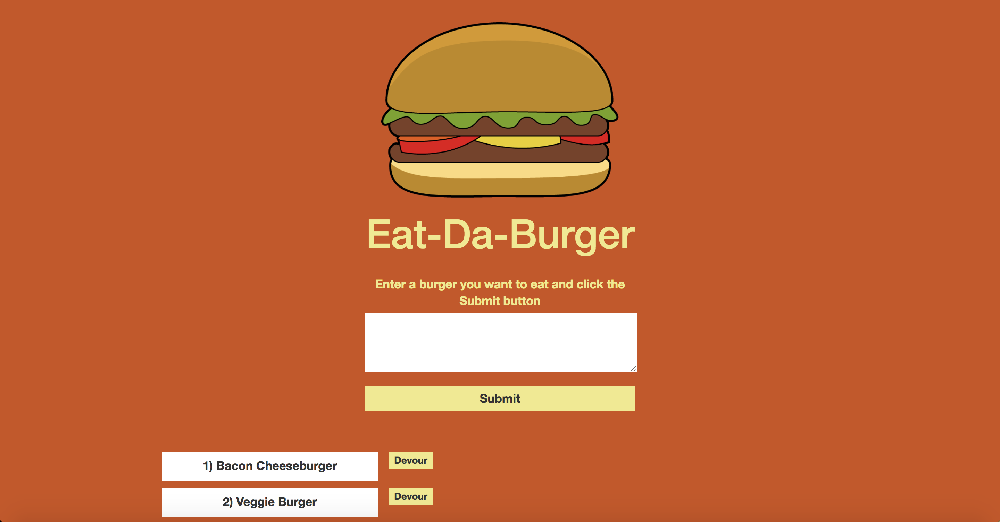
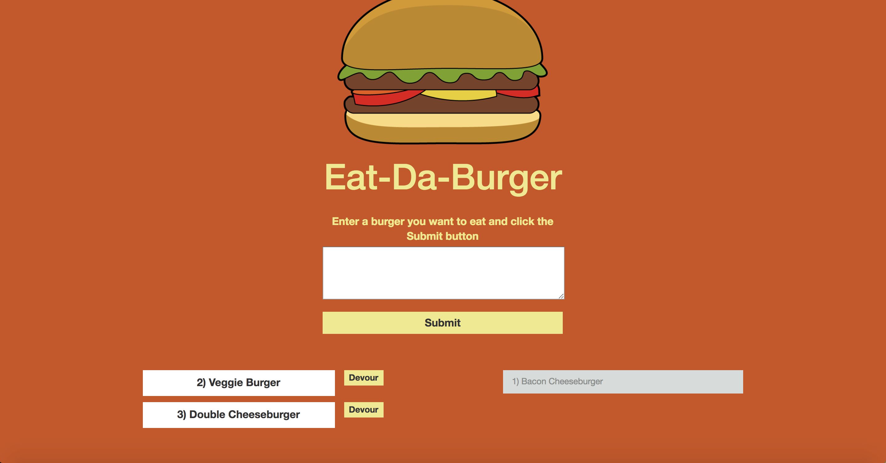

# Eat-Da-Burger

## Summary

Eat-Da-Burger is a burger eating simulator where the user enters in any kind of burger they want to eat and when they hit submit, that information is stored in a MySQL database and the page reloads to display the information the user just typed with a "Devour" button next to it. When the user enters a new burger, an entry in the "devoured" column is made with a boolean value of false, signifying that the burger has not yet been devoured. When the user clicks the "Devour" button, a PUT request is submitted that updates the "devoured" column to true and the page reloads. The "devoured" burger then appears in a separate column on the page and the "Devour" button disappears. This rearrangement is done using handlebars.js built-in #each, #unless and #if functions to loop through the database on page load and separate devoured burgers from non-devoured burgers and display each in separate columns on the page. 

The app employs MVC to route GET, PUT and POST requests and to post and retrieve information from the database. The view utilizes handlebars.js as its view engine, and node.js and express.js to handle server and backend logic. 